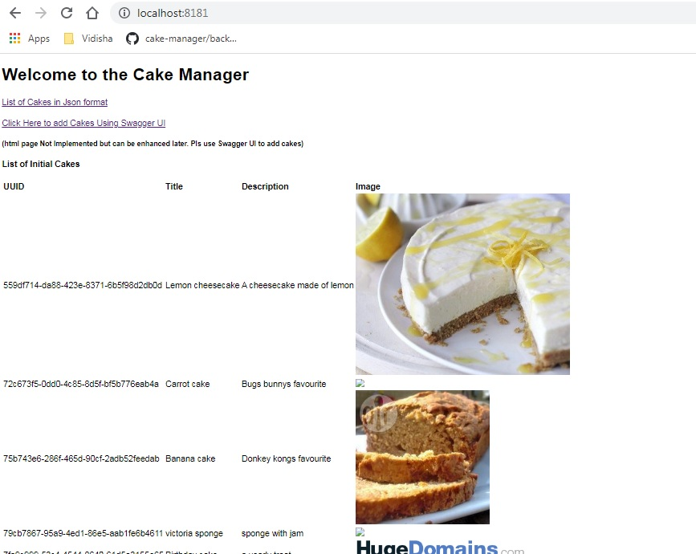
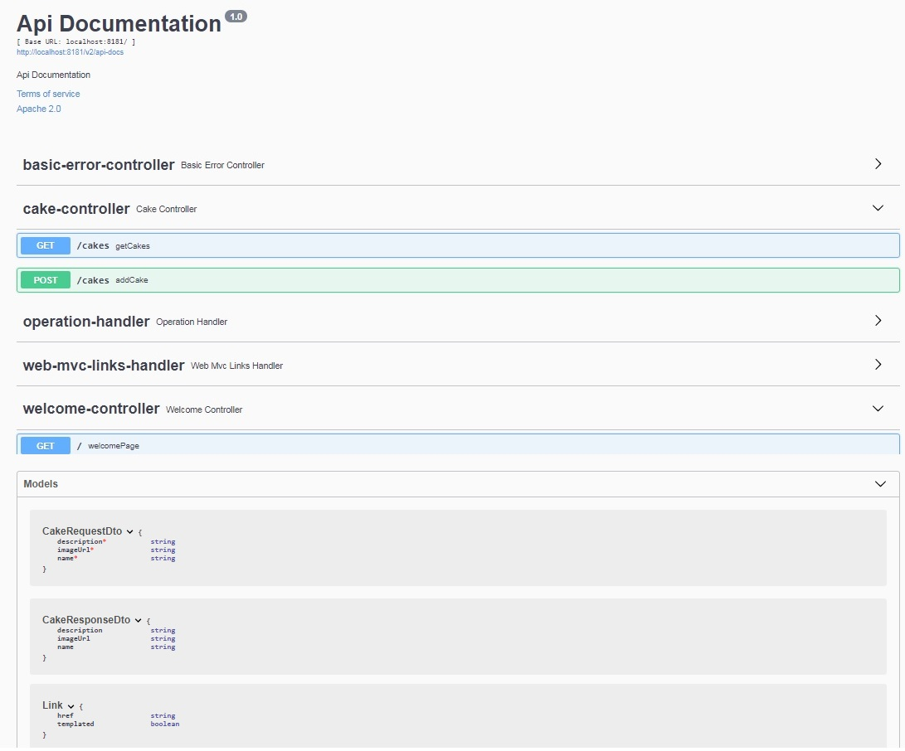

Cake Manager Micro Service (fictitious)
=======================================

Cake Manager App is a Java SpringBoot application.

mvn clean install <br>
mvn spring-boot:run


### How to Test
```
git clone https://github.com/s4sushil/cake-manager.git
cd cake-manager
mvn spring-boot:run
```

## Access URL
http://localhost:8181/


### REST End points
To get the cakes -
```
* GET http://localhost:8181/
```
To post the cakes -
```
curl -X POST "http://localhost:8181/cakes" -H "accept: */*" -H "Content-Type: application/json" -d "{ \"description\": \"ME\", \"imageUrl\": \"URL\", \"name\": \"Sushil\"}"
```

### Welcome Page



### Add Cake By Normal User Page


### Swagger Api docs and Rest endpoints - Adding Cakes by rest Json format
